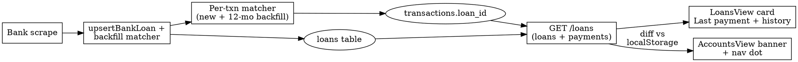

# Loan detection, linking, and Assets cleanup — design

**Date:** 2026-05-27
**Status:** Design approved; ready for implementation plan.

## Problem

Three related gaps in how Hon handles bank-scraped loans today:

1. **Duplicated home.** Bank-scraped loans appear in *both* the Assets tab
   (their own section alongside accounts) and the Loans tab. Two surfaces for
   the same data → mental friction and rendering work.

2. **Invisible loan-payment transactions.** When a bank sync brings in a loan
   payment (e.g. `הלואה-תשלום 108` from Beinleumi), it lands in Activity as a
   miscategorised "Fees" row. There is no linkage between the payment and the
   loan record, so the Loans tab can't show "Last payment", "12 payments this
   year", or "Possibly missed a month".

3. **Silent loan detection.** A bank sync can quietly create a brand-new loan
   the user didn't know existed (or didn't realise Hon now tracks). Nothing
   tells them; they only notice if they open the Loans tab.

## Goals

* Loans live in one place — the Loans tab.
* Each bank-scraped loan card shows its payment history sourced from the
  account's transaction stream, with a "Last payment" badge so missed months
  are noticeable.
* A new loan detected during a sync surfaces an inline notification and a
  Loans-tab indicator dot the next time the user opens the app.
* Misses and false-positives in the matching heuristic are fixable with one
  click from the existing Activity transaction sidebar.

## Non-goals

* No payment schedule comparison vs. the Spitzer amortisation — that's a
  follow-up. ("On track / 2 months ahead" badges are out of scope.)
* No retroactive recategorisation of payment transactions away from Fees. The
  category surface stays as-is; the loan↔payment link is metadata, not a
  category swap. (The user explicitly chose this.)
* No engine change to the post-scrape return shape. New-loan detection is
  computed UI-side via a localStorage snapshot, which keeps the engine
  contract stable.
* No support for splitting a single payment across multiple loans.

## Architecture

Three lanes, mostly independent so they can land in any order:

### 1. Engine — `transactions.loan_id` column + auto-matcher

* New SQLite column on `transactions`: `loan_id TEXT REFERENCES loans(id)`,
  nullable, no `ON DELETE CASCADE` (we want to keep the orphaned link history
  visible if a loan is deleted — but null it out via an explicit migration
  step at delete-time).
* New `Repo.setTransactionLoan(txnId, loanId | null)` setter.
* New `Repo.listLoanPayments(loanId)` — `SELECT * FROM transactions WHERE
  loan_id = ? ORDER BY date DESC`.
* `Repo.upsertBankLoan` is augmented: after the loan is written, run the
  auto-matcher over the past 12 months of that connection's transactions to
  backfill the history immediately. (Today the loan would appear empty until
  the next month's payment lands.)
* After each scrape's `transactions.upsert` pass, run the auto-matcher over
  the newly-inserted negative-amount rows for the same connection.

**Matcher algorithm** (pure function `matchPaymentToLoan(txn, loansOnConn)`):

Scope: the candidate set is every transaction belonging to ANY account of
the loan's `connectionId` (loans live at the connection level — a single
connection can have multiple accounts, any of which might be the debit
account for the loan). Filter to negative amount, `loan_id IS NULL`,
description non-empty.

For each candidate, against that connection's loans:

1. **External-id hit** — description contains `loan.externalId`. Strongest
   signal; pick this match.
2. **Name-token hit** — strip "הלוואה"/"halvaa"/"loan" from `loan.name`,
   split on whitespace + punctuation, and check whether the description
   contains any remaining token of length ≥ 3.
3. **Single-loan fallback** — if the connection has exactly one loan AND the
   description contains "הלוואה" / "halvaa" / "loan" (case-insensitive), pick
   that loan.

If multiple loans tie at the same rule, leave `loan_id` null — the user can
disambiguate manually.

### 2. Engine — `/loans` augmented with `payments`

`GET /loans` already returns `{ loans: Loan[] }`. Augment each `Loan` shape
with a `payments` field:

```ts
interface Loan {
  // …existing fields…
  payments: { id: string; date: string; amount: number; accountId: string }[];
}
```

Sorted newest-first. No new endpoint — one round trip keeps the LoansView
fetch shape (single `/loans` request).

### 3. Engine — `PATCH /transactions/:id/loan`

For the manual override. Body: `{ loanId: string | null }`. Validates that
`loanId` (when present) is a real loan id; null clears the link. No effect on
the auto-matcher's next run (it skips rows where `loan_id` is already set,
including ones the user explicitly nulled — *deliberately*, so a manual
"unlink" sticks).

### 4. Web — Assets tab drops the Loans section

`AccountsView`:
* Remove `loans: l.loans` from the parallel fetch (one fewer `/loans` request
  on tab open).
* Remove the `<LoanCard>` render block + the loans section header.
* The "Nothing here yet" empty-state copy still says "or add a hand-entered
  asset" — re-word to drop the loan mention.
* The data type `AssetSectionKey` keeps `'loan'` so other code paths
  don't churn, but it's no longer used in `AccountsView`.

### 5. Web — LoansView card grows a payment history section

`LoansView`'s loan card body:
* Header gets a small `.loan-last-paid` badge: `✓ Last payment: ₪1,747 on
  10 May` (green when within ~35 days of today, amber + "Possibly missed"
  hint otherwise).
* Foot: collapsible `▾ N payments` toggle; expanded body is a list of rows
  (date · amount · account label).
* Up to 24 rows initially with "Show more" → 24 more per click.
* Hidden when `payments.length === 0` (manual / SnapTrade loans).

### 6. Web — Activity sidebar gains a "Loans" section

The existing transaction-move sidebar (`CategoryPickerSidebar` in
`activity/ActivityView.tsx`) already has Category, Reimbursement, and
Splitwise sections. Add a fourth:

```
Loans
  [Linked: "Mortgage" · ✕ Unlink]              ← when loan_id is set
  - or -
  [+ Link to a loan]                            ← when null
```

The `+ Link` opens a small picker dialog with the available loans (one per
row, name + outstanding balance), filtered to loans on the same connection
when the transaction's account belongs to one of them. PATCHes
`/transactions/:id/loan { loanId }` and refetches.

### 7. Web — post-sync new-loan banner + nav dot

Diff-based detection lives entirely in `AccountsView`:

* Two localStorage keys, both JSON-encoded arrays of loan ids:
  * `hon.knownLoanIds` — the snapshot of "loans the user has acknowledged".
    Written only when the user opens the Loans tab (cleared and rewritten
    on `LoansView` mount) or when the banner is dismissed.
  * `hon.unseenLoanIds` — the queue of "new since last acknowledgement".
* On every `/loans` load (initial mount + after a sync's `runStatus.status
  === 'success'` branch), compute `currentIds − knownIds`. Append any
  fresh ids to `unseenLoanIds` (de-duped). DON'T touch `knownLoanIds` here —
  if it auto-updated on every render, the diff would always be empty.
* While `unseenLoanIds` is non-empty, render an inline banner at the top of
  the Assets tab body: `✨ Found N new loan(s) from <bank-name> — View in
  Loans · ✕`. Bank name pulled from the loan's `connectionId` → connection's
  `displayName`. The banner's "View in Loans" link AND the ✕ both move
  `unseenLoanIds` → `knownLoanIds` and clear the banner.

Sidebar nav dot:
* `App.tsx`'s `<nav>` reads `localStorage['hon.unseenLoanIds']` (cheap; same
  key the banner uses).
* When non-empty, the Loans nav button renders a small amber dot in its
  top-right corner (CSS pseudo-element `.nav-btn[data-unseen]::after`).
* Cleared on `LoansView` mount.
* The dot uses a single CSS keyframe pulse so it's noticeable without being
  loud.

## Data flow



## Error handling

* Auto-matcher is best-effort: it logs `matcher.miss` for descriptions it
  can't pin down. The transaction stays unlinked; user can fix via the
  Activity sidebar.
* `setTransactionLoan` is a single SQL `UPDATE`; failures return the
  engine's standard error response and the UI surfaces them as a form
  error inline.
* The localStorage snapshot can desync (user clears storage, opens on a new
  device). On a desync, *every* current loan id is seen as "new" → the
  banner could spam. Mitigation: cap the banner at 3 loans named, with
  "+ N more"; the user dismisses once and the snapshot syncs.
* Migration: the new `loan_id` column starts null on every existing row;
  no data movement on first start.

## Testing

Engine (Vitest):

* `matchPaymentToLoan` — table-driven test over: external-id hit, name-token
  hit (Hebrew + English), single-loan fallback, multi-loan tie (returns
  null), already-set rows (untouched).
* `upsertBankLoan` backfill — given a loan with `externalId X` and a
  pre-existing transaction with description containing X, after upsert the
  txn carries `loan_id`.
* `PATCH /transactions/:id/loan` — sets, clears (null), and rejects an
  unknown loanId.
* `GET /loans` — includes a `payments` field per loan; ordered newest-first.

Web (React Testing Library, TDD):

* `AccountsView` no longer renders any `loan-card`.
* `LoansView` — card shows "Last payment: …" when payments exist; the
  expandable history toggles; shows nothing when `payments.length === 0`.
* `LoansView` — overdue (>35d) flips the badge to amber + "Possibly missed".
* `AccountsView` — after a sync that adds a new loan id (mocked by mutating
  the `/loans` fetch response between renders), the banner appears and the
  link navigates to the Loans tab.
* `App` — when `localStorage['hon.unseenLoanIds']` is non-empty, the Loans
  nav button carries the `.nav-btn--unseen` modifier (snapshot the
  attribute, not pixels).
* Activity sidebar — Loans section renders the loan picker; clicking a
  loan PATCHes; "✕ Unlink" PATCHes null.

## Migration notes

* SQLite schema bump (CLAUDE.md describes `SCHEMA_VERSION` in `db.ts`):
  add one migration that `ALTER TABLE transactions ADD COLUMN loan_id TEXT`.
  SQLite `ALTER TABLE … ADD COLUMN` doesn't accept a `REFERENCES` clause,
  and SQLite doesn't enforce foreign keys without an explicit `PRAGMA
  foreign_keys = ON` anyway — so the column is a plain `TEXT` and integrity
  is maintained by `setTransactionLoan`'s loan-id validation, plus the
  delete-time null-out step. No backfill in the migration itself — the
  first sync after the upgrade runs the matcher against the past 12 months,
  which catches up.
* The `transactions` table is large in long-running databases. The matcher
  is bounded by `WHERE date >= now - 12 months AND account_id IN (...)` and
  by the small number of loans per connection, so the per-sync cost stays
  in the milliseconds.

## Out of scope (deliberate)

* No "Loans" sub-category being created — payments stay in whatever category
  they were given (typically Fees).
* No Activity-row chip linking to the loan — the only place the link is
  visible is from the loan card looking down at its payments.
* No SnapTrade / pension / manual-loan handling beyond "matcher skips them"
  (their `connectionId` is null).
* No iCloud / cross-device sync of `unseenLoanIds` — localStorage only, by
  design (Hon is local-first).
